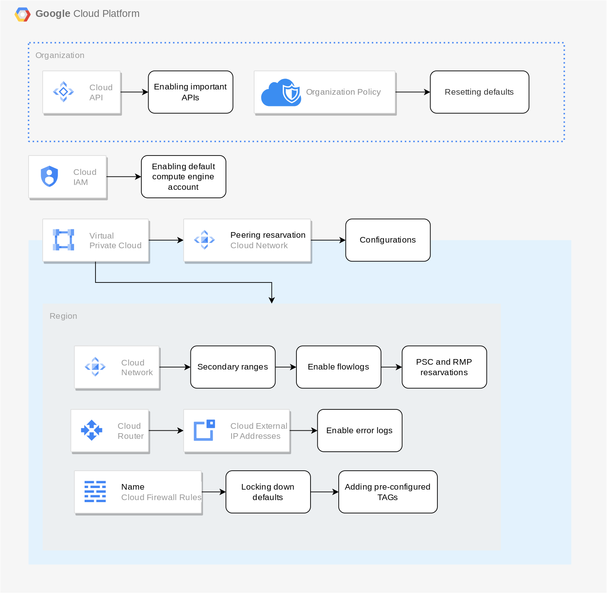

# GCP Terraform Landing Zone for Rapid Demos



This Terraform project deploys a foundational Google Cloud Platform (GCP) environment, including a new project and a VPC network. It is designed for rapid development and prototyping, allowing you to quickly stand up a sandbox for concept demos.

## Prerequisites

Before you begin, ensure you have the following tools installed:

*   [Google Cloud SDK](https://cloud.google.com/sdk/docs/install-sdk)
*   [Terraform](https://learn.hashicorp.com/tutorials/terraform/install-cli)

## 1. Authentication

You must authenticate with GCP for both the `gcloud` CLI and for Terraform to use Application Default Credentials (ADC).

```bash
# Log in to your Google Cloud account
gcloud auth login

# Set up Application Default Credentials for Terraform
gcloud auth application-default login
```

## 2. Configuration

This project includes a helper script to automatically configure the necessary Terraform variables.

Run the `populate.sh` script to create your `terraform.tfvars` file. This script will automatically detect and populate your GCP Billing Account ID and Organization ID.

```bash
./populate.sh
```

This will create a `terraform.tfvars` file. You can review the other variables in `variables.tf` and override them in this file if needed.

## 3. Deployment

Once your configuration is in place, you can deploy the infrastructure using the standard Terraform workflow.

```bash
# Initialize Terraform and download the necessary providers
terraform init

# (Optional) Review the execution plan
terraform plan

# Apply the configuration to create the GCP resources
# The --auto-approve flag is used for convenience in this demo environment
terraform apply --auto-approve
```

## 4. Cleanup

To tear down the deployed infrastructure and clean up your local workspace, follow these steps.

### Step 1: Destroy GCP Resources

Use the `terraform destroy` command to remove all resources created in GCP.

```bash
# Destroy all infrastructure
terraform destroy --auto-approve
```

### Step 2: Clean Local Directory

This project includes a `cleanup.sh` script to remove local Terraform state files, caches, and logs. This is useful for a complete reset of the local environment.

```bash
./cleanup.sh
```

## Additional Resources

*   [Full FAST example from Google](https://github.com/GoogleCloudPlatform/cloud-foundation-fabric/tree/master/fast)
*   [Google Cloud Landing Zone Design](https://cloud.google.com/architecture/landing-zones)
*   [Terraform on Google Cloud](https://cloud.google.com/docs/terraform)
*   [Terraform CDK](https://developer.hashicorp.com/terraform/cdktf)